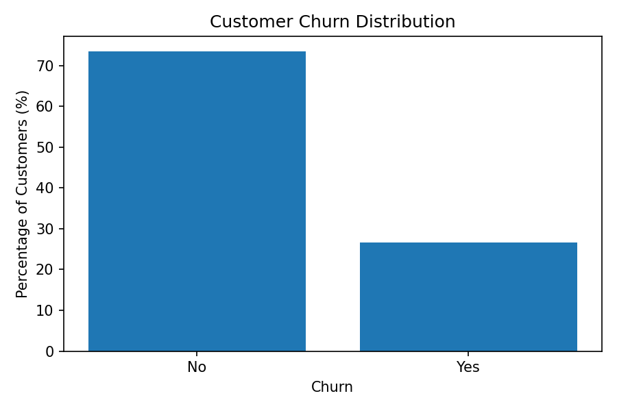
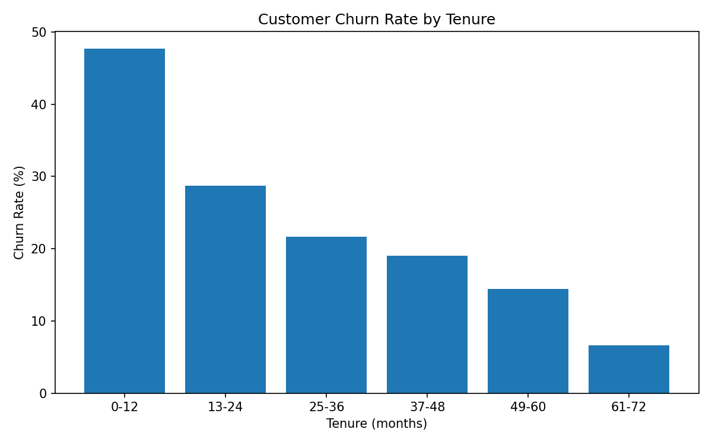

# Telco Customer Churn Analysis

## Visuals (Preview)

<details>
<summary><b>Click to expand charts</b></summary>

### 📊 Customer Churn Distribution


### 📈 Churn Rate by Tenure


*Note: More visualizations can be found in the `reports/` folder.*
</details>

---

## Overview

This project analyzes **customer churn in a telecommunications company** to understand *why customers leave* and which factors most strongly influence churn behavior.

Rather than relying on predictive modeling, the focus is on **exploratory and business-driven analysis** to identify actionable churn drivers that can inform retention strategies.

---

## Business Question

**What factors drive customer churn, and which segments are most at risk?**

---

## Analysis Approach

To answer the business question, the analysis follows a structured approach:

- **Descriptive Analysis**: Explore overall churn behavior.
- **Segment Comparison**: Identify customer groups with higher attrition risk.
- **Factor Attribution**: Analyze key drivers like contract type, tenure, and services.
- **Actionable Insights**: Translate findings into concrete business recommendations.

---

## Data Sources

The analysis uses the public **Telco Customer Churn Dataset**, which contains:
- **Customer Profile**: Gender, seniority, partner, and dependents.
- **Service Usage**: Internet type (DSL, Fiber optic), security, tech support, etc.
- **Contract & Billing**: Tenure, contract type, payment method, and charges.
- **Target**: Churn status (Yes/No).

---

## Key Metrics

- **Churn Rate (%)**: Percentage of customers who left the service.
- **Customer Count**: Segment size and business impact.
- **Tenure (Months)**: Customer lifetime with the company.
- **Monthly Charges**: Pricing sensitivity indicator.

---

## Key Findings

### 1️⃣ Early tenure is the highest churn risk  
Customers in their first 12 months show the highest churn rate (~47%), indicating that onboarding and the early experience are critical.

### 2️⃣ Contract type strongly impacts churn  
**Month-to-month contracts** have significantly higher churn than long-term contracts, highlighting commitment as a key retention factor.

### 3️⃣ Electronic check users are high-risk  
Customers using electronic checks churn at higher rates compared to those using automatic payment methods.

### 4️⃣ Premium services (Fiber Optic) see more attrition  
Fiber optic users have higher churn rates, suggesting potential pricing friction or unmet expectations relative to DSL.

### 5️⃣ Technical support is a retention lever  
The lack of technical support and security services is strongly associated with higher churn.

---

## Business Recommendations

- **Contract Migration**: Incentivize customers to move from month-to-month to one-year or two-year contracts.
- **Payment Optimization**: Promote the adoption of automatic payment methods (credit card/bank transfer).
- **Onboarding Focus**: Implement a "high-touch" engagement strategy during the first 12 months.
- **Service Value**: Review the value proposition for Fiber Optic customers to justify higher charges.
- **Support Strategy**: Bundle security and technical support services to increase customer "stickiness."

---

## Project Structure

```text
project-04-telco-churn/
├── data/
│   ├── raw/                 # Original dataset (git-ignored)
│   └── processed/           # Processed files for analysis
├── notebooks/
│   └── src/
│       └── 01_telco_churn_analysis.ipynb
├── reports/                 # Exported visualizations
│   ├── churn_distribution.png
│   ├── churn_by_tenure.png
│   └── [other_visuals].png
├── README.md
├── .gitignore
└── requirements.txt
```

---

## How to Run Locally

1. **Clone the repository**:
   ```bash
   git clone [repository-url]
   ```
2. **Install dependencies**:
   ```bash
   pip install -r requirements.txt
   ```
3. **Run the Notebook**:
   ```bash
   jupyter notebook notebooks/src/01_telco_churn_analysis.ipynb
   ```

---

## Skills Demonstrated

- **Business Problem Framing**
- **Exploratory Data Analysis (EDA)**
- **Segmentation & KPI Interpretation**
- **Data Storytelling & Visualization**
- **Strategic Decision Support**

---

## Data Source

The dataset used in this project is publicly available on Kaggle:
[Telco Customer Churn - IBM Sample Data Sets](https://www.kaggle.com/datasets/blastchar/telco-customer-churn)
